# Физический справочник на Delphi. #

Написан в качестве проектной деятельности по информатике в 2017 году, дополнен в 2018 для научно-практической конференции международным участием «Наука настоящего и будущего» в СПбГЭТУ «ЛЭТИ». 

***Написан методом тыка по кнопкам в IDE Delphi 10.1 без знания о функциях, процедурах и ООП, git-а, системах проектирования интерфейсов и прочих крутых штуках.***

## Описание ##

> Автор: Кульбако Артемий Юрьевич  
Научный руководитель: Колосова Оксана Викторовна 
Образовательное учреждение: МБОУ Гимназия No5 Класс: 11А, город: Сосновый Бор

Моя программа поможет учащимся, изучающим физику, вспомнить основные формулы, величины и законы. Пользователи приложения «Физический справочник» могут быстро провести расчёты для необходимой формулы, а также узнать основные характеристики искомой величины, не обращаясь к глобальной паутине или справочной литературе, что положительно скажется на продуктивности их подготовки к экзаменам. «Физический справочник» содержит более 50 формул, каждая с краткой справочной информацией.

1. На главном экране вы можете выбрать одну физических величин или раздел физики, чтобы получить доступ к формула.

    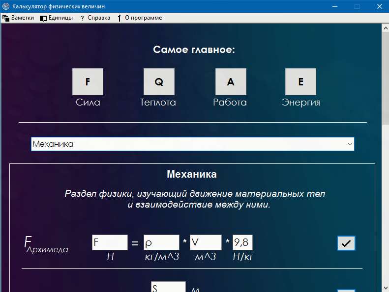
2. Вставьте ваши значения и нажмите на кнопку «Готово» чтобы получить результат вычислений.

    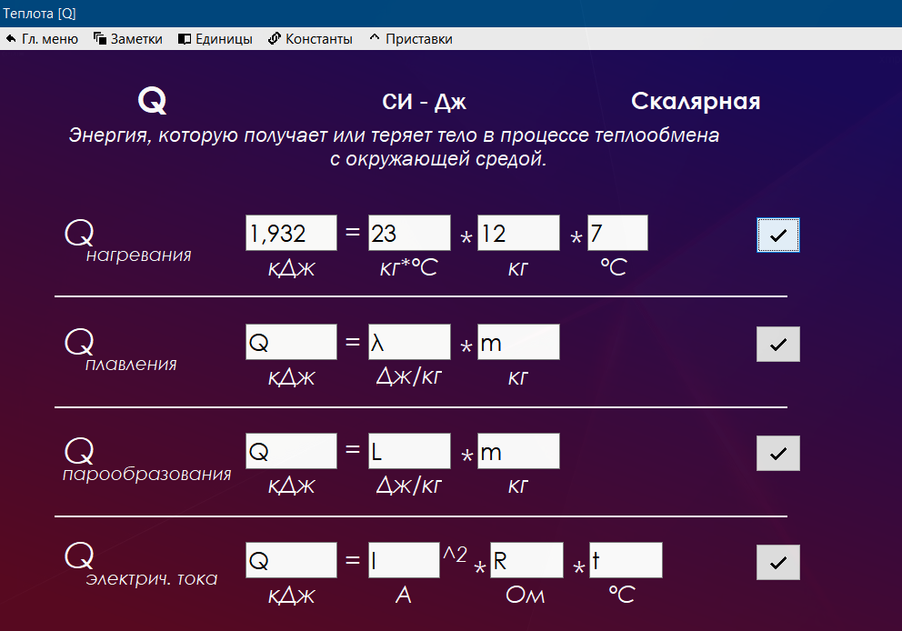

3. Нажмите на название искомой величины, чтобы получить краткое описание физического закона, которое она характеризует.

    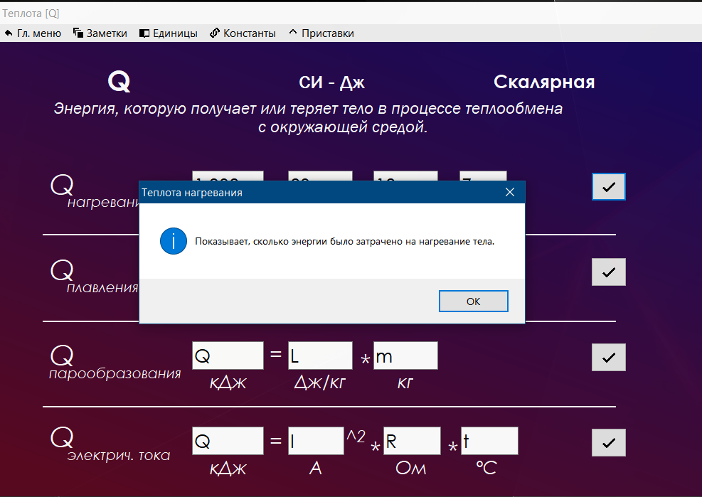

4. Используйте окно «Заметки», чтобы сохранить необходимую вам информацию и быстро получить к ней доступ в любой момент.

    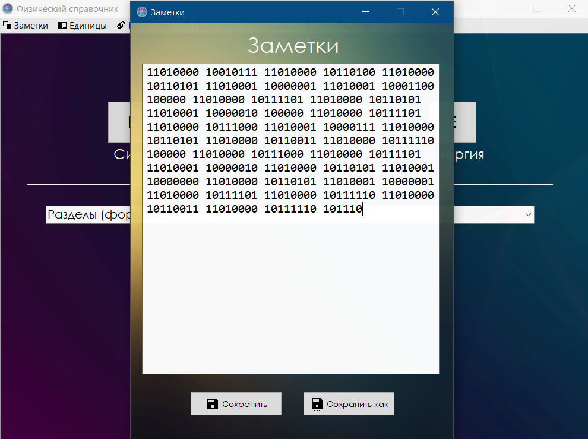

5. Вкладка «Единицы» даст вам доступ к характеристикам различных единиц. 

    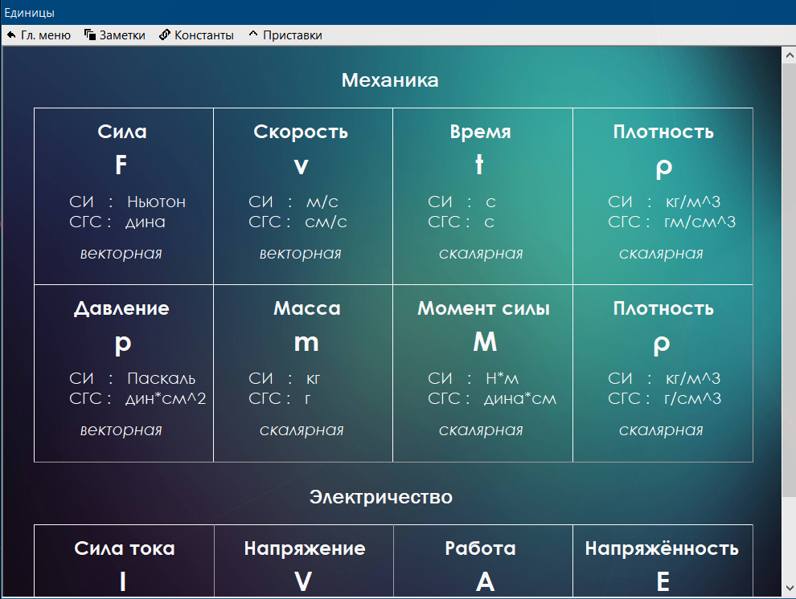

6. Воспользуйтесь вкладкой «Константы», чтобы посмотреть основные физические константы.

    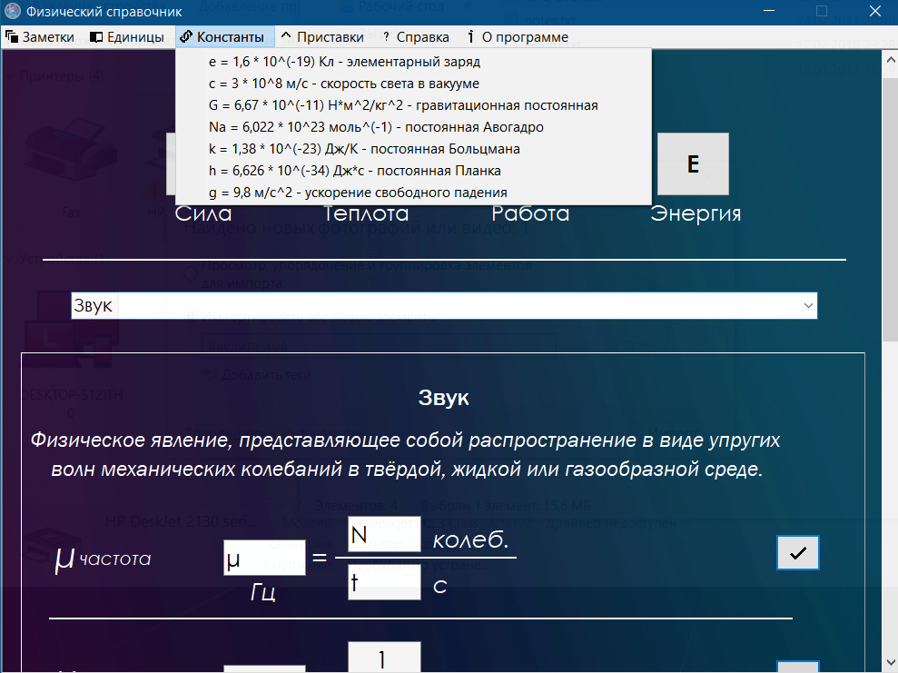

## Техническая информация ##

>Среда разработки: Delphi 10.2  
Язык программирования: Object Pascal  
Библиотека компонентов: VCL  
Поддерживаемые операционные системы: Windows 2000(x86) и выше  
RAM: 128 МБ  
VRAM: 32 МБ  
Необходимо свободного места: 17 МБ  
Язык интерфейса: русский

## Разработка ##

Работу над проектом я начал с поиска подходящей IDE – интегрированной среды программирования (англ. Integrated development environment) – комплекс программных средств, используемый для создания ПО. Выбор остановился на Delphi 10.2 Tokyo, 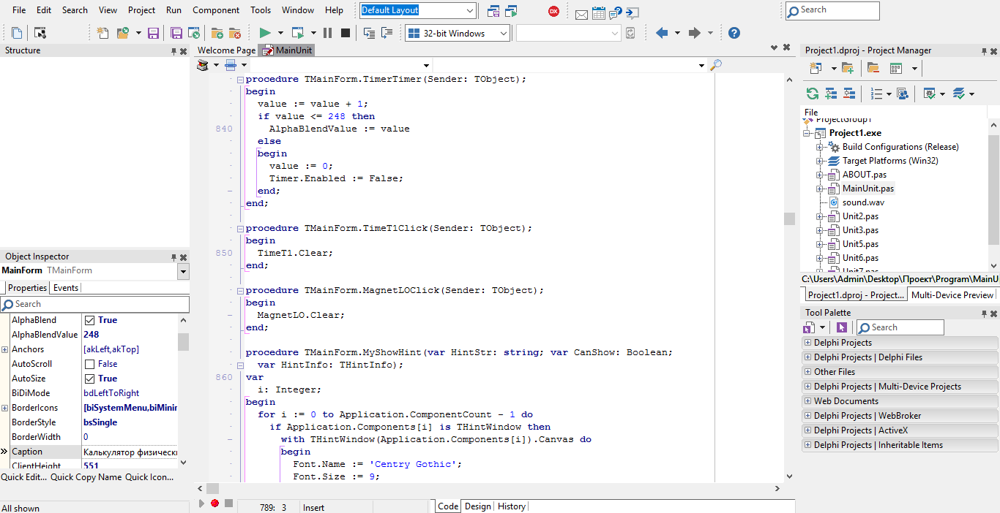 так как для разработки в ней используется язык Object Pascal, основы которого проходят в школе, в интернете множество справочной литературы и инструкций для этой IDE, Embarcadero Technologies (компания-разработчик) бесплатно предоставляет свой продукт для некоммерческого использования. Немного освоившись в среде разработки, я приступил к созданию концепта приложения, 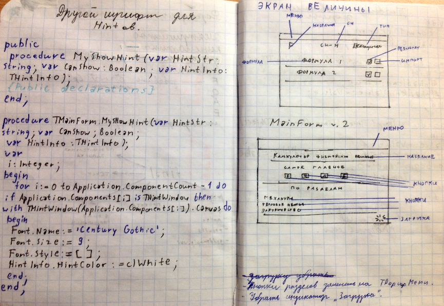 а позже и к работе в Delphi. Первые два месяца были самыми тяжёлыми. Одновременно приходилось более углублённо изучать среду разработки и язык программирования. Для экономии времени я не стал изучать все темы подряд: ставил задачу - решал её. Так, 30.12.2016 была создана версия, которая была похожа на мою задумку. 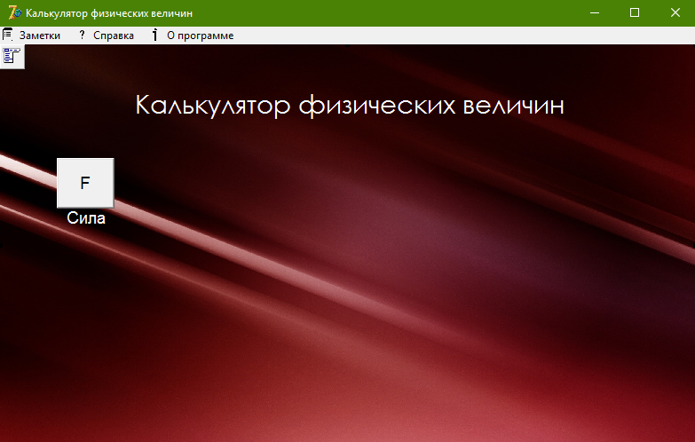 К сожалению, реальный результат оказался куда хуже ожидаемого. Было решено пересмотреть подход к группировке содержимого, а также осовременить интерфейс, путём добавления прозрачности, уменьшения количества кнопок и использования более тонкого и контрастного шрифта, чтобы пользователь мог сфокусироваться на содержимом программы, а не на программе. Были переработаны шрифты, кнопки, эффекты, фоны, справка и т.д. 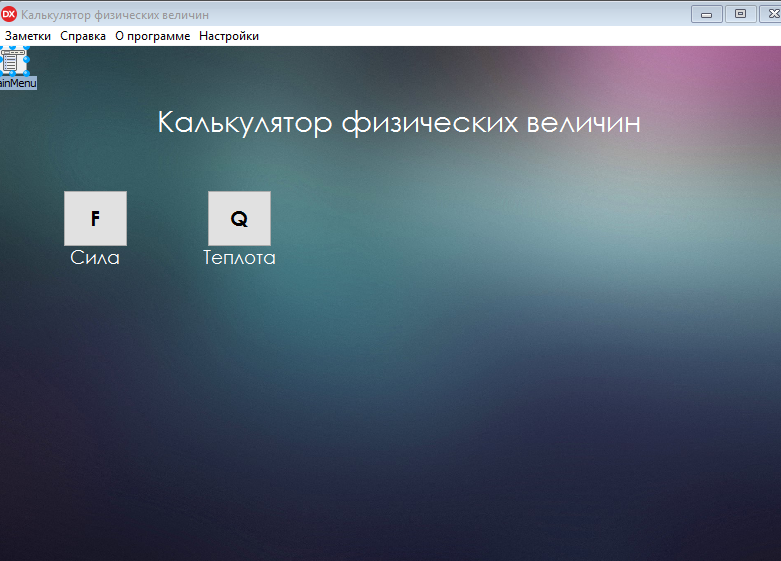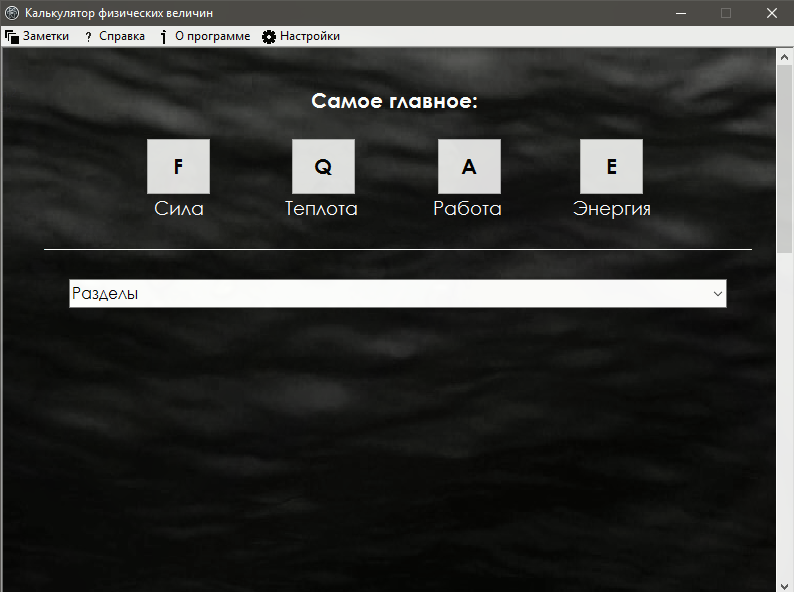 К этому времени код разросся до 1000 строк, что заставило меня его отформатировать для повышения читаемости, но вместе с форматирование была произведена оптимизация программы. Финальная версия приложения была протестирована на компьютерах с Windows XP, 7, 10 разной разрядности. Никаких ошибок или проблем при работе с программой найдено не было. 